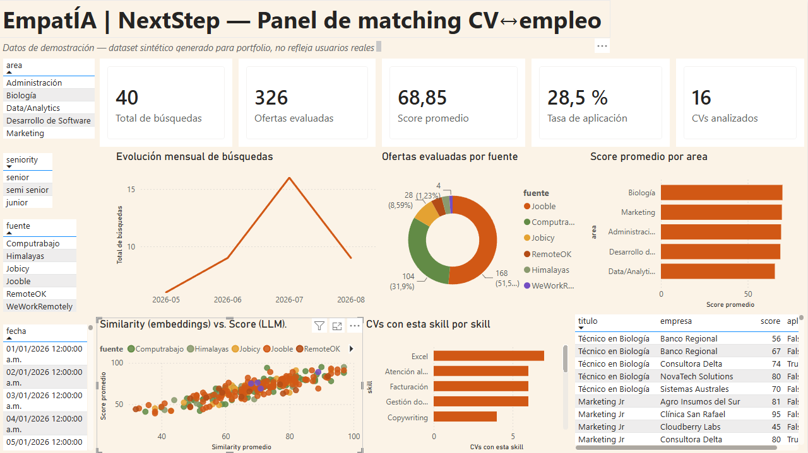

# EmpatÍA | NextStep

**Motor de matching entre CVs y ofertas de empleo, con IA — para cualquier
rubro, no solo tecnología.** Subís tu CV, el sistema entiende a qué te
dedicás, busca en seis portales de empleo a la vez y te devuelve las
ofertas rankeadas con una explicación real de por qué encajás (o por qué
no).

🔗 **[empatianextstep.com](https://www.empatianextstep.com)** · [Dashboard de
Power BI](#dashboard-de-power-bi-modelo-de-datos-y-analítica) · [Cómo está
armado](#arquitectura)

---

## El problema que resuelve

Buscar trabajo es repetir la misma tarea aburrida: entrar a cinco portales,
buscar los mismos términos, leer avisos casi iguales y decidir a ojo cuáles
valen la pena. Los buscadores filtran por palabra clave, así que un aviso de
"Analista de Datos Jr" no aparece si buscaste "Data Analyst" — y nada te
dice si realmente encajás con el puesto o te falta la mitad de lo que piden.

Este proyecto automatiza todo eso y agrega la parte que ningún portal hace:
**leer tu CV y el aviso, y explicarte el match en castellano**.

Y no está atado a IT. La clasificación del CV es abierta: funciona igual con
un perfil de ventas, de salud o de laboratorio — el sistema deduce el rubro
y arma sus propias búsquedas.

---

## Cómo funciona

```
        Tu CV (PDF)
             │
             ▼
   ┌──────────────────────┐
   │ 1. Clasificación     │  LLM chico (Groq): deduce rubro, seniority,
   │    del perfil        │  skills y arma los términos de búsqueda
   └──────────┬───────────┘
              ▼
   ┌──────────────────────┐
   │ 2. Búsqueda          │  6 portales en paralelo:
   │    multi-portal      │  Computrabajo · Jooble (generales)
   │                      │  RemoteOK · Jobicy · Himalayas ·
   └──────────┬───────────┘  WeWorkRemotely (tech)
              ▼
   ┌──────────────────────┐
   │ 3. Filtro semántico  │  Embeddings (Cohere multilingüe):
   │    (etapa barata)    │  "Analista de Datos" ≈ "Data Analyst Jr"
   └──────────┬───────────┘  aunque no compartan una sola palabra
              ▼
   ┌──────────────────────┐
   │ 4. Explicación       │  LLM grande (Groq) lee CV + aviso completos
   │    (etapa cara)      │  y devuelve score 0-100, por qué matcheás,
   └──────────┬───────────┘  qué te falta, y un veredicto en castellano
              ▼
   Ranking explicado + CV adaptado a cada oferta (.docx)
```

**La decisión de diseño central son las dos etapas.** Pasar cada aviso por
un LLM grande sería lento y caro; filtrar solo por palabra clave sería
pobre. La etapa 3 usa embeddings (prácticamente gratis) para descartar el
grueso del ruido, y la etapa 4 gasta el modelo caro solo en el puñado de
finalistas. Resultado: entendimiento real por centavos de dólar por
búsqueda.

---

## Dashboard de Power BI: modelo de datos y analítica

El mismo esquema que sirve a la aplicación se explota como modelo
analítico. No es un tablero decorativo sobre datos planos: la base guarda
las ofertas como **JSON anidado** dentro de Postgres, así que hubo que
aplanarlas a un modelo dimensional utilizable.



**Qué incluye este repo** (carpeta [`bi/`](bi/)):

| | |
|---|---|
| **Modelo** | Esquema estrella — `Fact_Ofertas` (grano: una oferta evaluada) + `Dim_CV`, `Dim_CV_Skills` y tabla calendario en DAX, con relación activa e inactiva (`USERELATIONSHIP`) |
| **SQL** | [3 vistas de Postgres](bi/sql/) que aplanan los `jsonb` anidados y cruzan el estado real de "aplicado" contra su tabla de eventos |
| **DAX** | 13 medidas documentadas: tasa de aplicación, % de alta compatibilidad, variación mes a mes, similarity vs. score |
| **Datos** | [Generador reproducible](bi/datos_demo/generar_datos_demo.py) de dataset sintético, con la forma exacta de las vistas reales |

📄 **[Documentación completa del dashboard →](bi/README.md)** — modelo,
medidas y el paso a paso para reconstruirlo.

> ⚠️ **Los datos del dashboard son sintéticos.** El proyecto es reciente y
> todavía no tiene volumen real de uso, así que el tablero corre sobre un
> dataset generado con la forma exacta del modelo productivo (mismas
> columnas, mismos portales, proporciones y rangos verosímiles). Es una
> decisión deliberada, no un dato inflado: el modelo dimensional, las
> relaciones y el DAX son los mismos que correrían contra la base real —
> solo cambia el origen de datos.

Un detalle de modelado que vale la pena mirar: el campo `applied` que viaja
dentro del JSON de resultados **nunca se actualiza** después de guardarse
(se escribe una vez y se parchea en memoria al leer). Usarlo para analítica
histórica daría siempre cero. Por eso la vista
[`vw_bi_ofertas`](bi/sql/03_vw_bi_ofertas.sql) ignora ese campo y hace
`LEFT JOIN` contra `applied_jobs`, que es la tabla que sí registra el
evento con su fecha.

---

## Arquitectura

```
Navegador (Next.js + Tailwind, en Vercel)
     │  subís el CV · ves los matches · marcás "ya apliqué"
     ▼
API (FastAPI, en Render)
     │  orquesta el motor, autentica, limita el uso
     ▼
Motor de matching (Python)          Supabase (Postgres)
  cv_profile.py     → clasifica ←→   CVs, corridas de matching,
  pipeline.py       → busca          ofertas aplicadas, avisos
  semantic_match.py → rankea               │
                                           ▼
                                  Power BI (modelo analítico)
```

**Además:**

- **Avisos semanales por mail** — un cron de GitHub Actions revisa cada
  lunes si hay ofertas nuevas para quienes lo activaron y manda solo lo que
  esa persona todavía no vio (Resend, dominio propio verificado). Opt-in:
  apagado por defecto.
- **CV adaptado por oferta** — genera bajo demanda un `.docx` reescrito
  para ese aviso puntual, y lo cachea.
- **Cuentas reales** con Supabase Auth, límite de 2 búsquedas diarias por
  persona y política de privacidad propia.

---

## Stack

| Capa | Tecnología |
|---|---|
| **Frontend** | Next.js 16, React 19, Tailwind v4 (Vercel) |
| **Backend** | Python 3.13, FastAPI (Render) |
| **Base de datos** | Supabase / PostgreSQL — RLS activo, `jsonb` |
| **IA — clasificación y explicación** | Groq (`gpt-oss-20b` / `gpt-oss-120b`) |
| **IA — filtro semántico** | Cohere `embed-multilingual-v3.0` |
| **Analítica / BI** | Power BI Desktop, DAX, vistas SQL |
| **Scraping** | `requests` + `BeautifulSoup4`, 6 fuentes |
| **Automatización** | GitHub Actions (cron semanal), Resend |

---

## Decisiones técnicas que valen la pena contar

**El motor pedía 768 MB de RAM y el hosting gratuito da 512.** El filtro
semántico corría con `sentence-transformers` + `torch` en local: 800 MB de
dependencias y un modelo de 400 MB descargado en cada arranque. Migrarlo a
la API de Cohere bajó el motor a ~150 MB — pasó a entrar en un plan gratis
sin perder calidad de matching, y toda la dependencia quedó aislada en una
sola función (`_embed()`), así que cambiar de proveedor es reescribir eso y
nada más.

**Las búsquedas devolvían cero desde la web pero funcionaban por consola.**
Windows corría el motor con una codificación heredada que no sabe escribir
la flecha `→` que el pipeline imprime al mostrar progreso. Cada búsqueda
moría en silencio dentro de un `print`. Se arregló forzando UTF-8 al
arrancar la API.

**Un `upsert` que rompía solo con datos reales.** Marcar ofertas como
"vistas" fallaba con el error de Postgres *"ON CONFLICT DO UPDATE command
cannot affect row a second time"* cuando el mismo aviso aparecía dos veces
en la misma tanda. Se resolvió deduplicando con `dict.fromkeys()`, que
además preserva el orden — a diferencia de un `set`.

**Cuando Groq dio de baja toda la línea Llama**, el clasificador empezó a
devolver 404 y se rompió la subida de CV. Los modelos quedaron
centralizados en una constante por archivo, verificados contra la lista
real de la cuenta.

---

## Correrlo localmente

```bash
git clone https://github.com/MarcosGriffa/job_scraping.git
cd job_scraping

python -m venv venv && venv\Scripts\activate    # Windows
pip install -r requirements.txt

cp .env.example .env    # completar con tus API keys
```

Necesitás claves gratuitas de [Groq](https://console.groq.com) y
[Cohere](https://dashboard.cohere.com); opcionalmente
[Supabase](https://supabase.com) (sin ella guarda en archivos locales) y
[Jooble](https://jooble.org/api/about).

**En Windows:** doble clic en `INICIAR_WEB.bat` levanta todo.
**Manual**, en dos terminales:

```bash
python -m uvicorn api.main:app --reload --port 8000   # motor
npm --prefix web run dev                              # web → localhost:3000
```

---

## Documentación

| Documento | Contenido |
|---|---|
| [`bi/README.md`](bi/README.md) | Dashboard de Power BI: modelo, DAX, paso a paso |
| [`README_FASE2.md`](README_FASE2.md) | La web actual: cómo está armada y por qué |
| [`README_FASE1.md`](README_FASE1.md) | Evolución del motor de matching |
| [`README_BOT_TELEGRAM.md`](README_BOT_TELEGRAM.md) | La versión original: pipeline + bot de Telegram |
| [`README_DEPLOY.md`](README_DEPLOY.md) | Publicar en Vercel + Render, paso a paso |
| [`supabase/schema.sql`](supabase/schema.sql) | Esquema de la base, comentado |

---

## Autor

**Marcos Griffa** — Estudiante de Lic. en Ciencia de Datos (UBA)

[LinkedIn](https://linkedin.com/in/marcos-griffa-605aa3259) ·
[GitHub](https://github.com/MarcosGriffa) ·
[Portfolio](https://portfolio-griffa.vercel.app)
